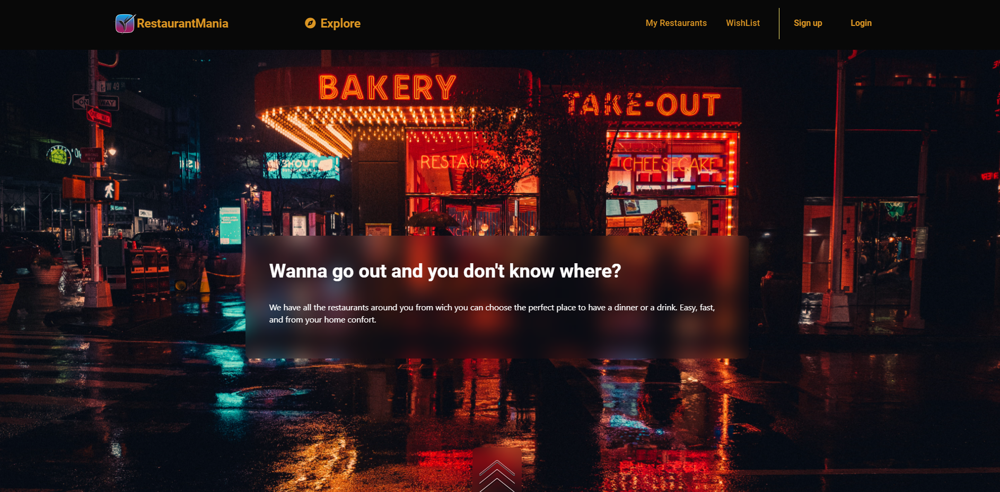
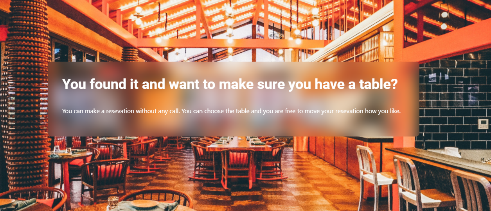
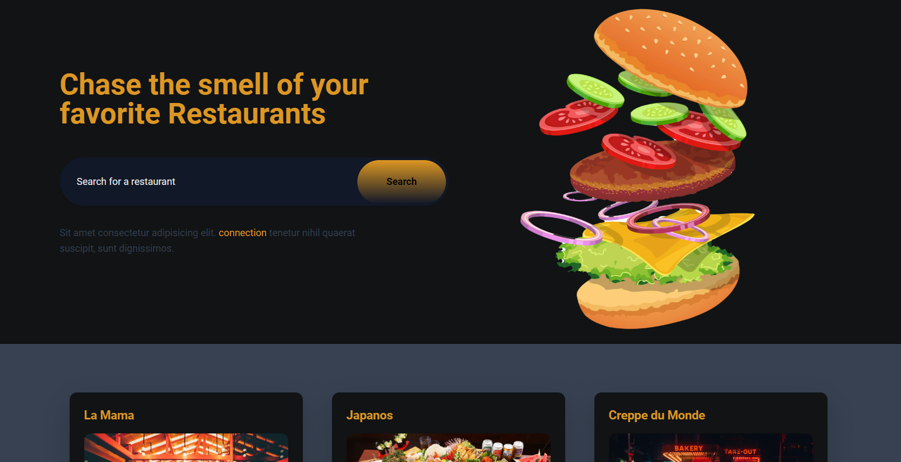
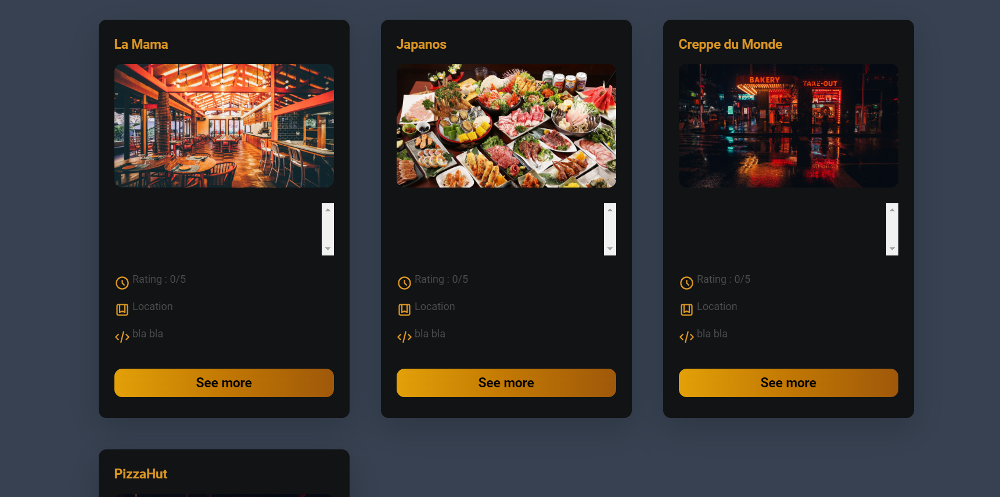
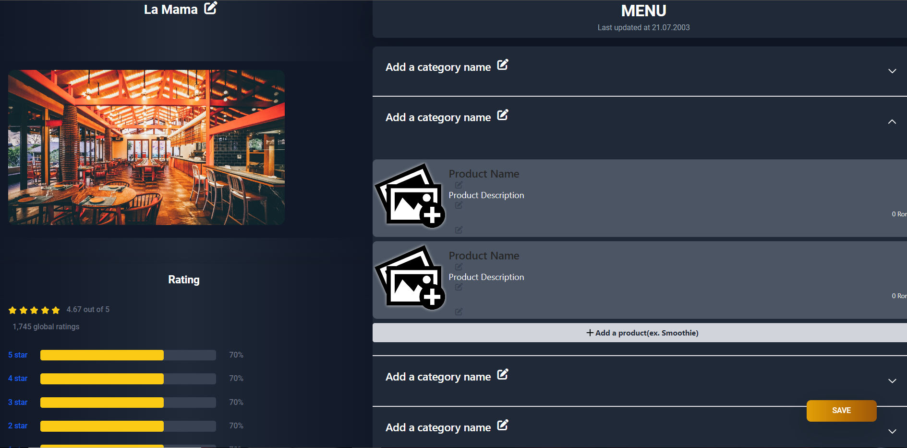

# RestaurantMania

## Project Description

RestaurantMania is a web application designed to help users easily and quickly find their desired restaurants. It provides a comprehensive list of restaurants with detailed information, including location, operating hours, menus, prices, product images, and ratings. Users can also publish their own restaurants and easily update their content.



### Technologies Used:

We utilized the following technologies to create RestaurantMania:

- **Spring**: Accelerated Java application development, creating necessary APIs and database repositories.
- **Supabase**: A remote database similar to PostgreSQL, accessible for all project developers.
- **Amazon Web Services (AWS)**: Facilitated storage and access to restaurant and product images.
- **React**: A popular web application library known for its effectiveness in creating interactive and dynamic UI components.
- **Bootstrap** and **Tailwind**: Used for impressive and responsive styling, in addition to custom CSS.
- **CSS**: Additional custom styling.

### Challenges

During development, we faced the following challenges:

- As first-time users of Spring, creating CRUD operations and establishing database relations presented a minor challenge.
- While attempting to use Supabase's Storage service, we found limited documentation and an unfinished library, leading us to use AWS storage instead.

### Future Plans

Our future plans for RestaurantMania include:

- Implementing payment functionality for users registering a restaurant, moving from a demo to a fully functional platform.
- Adding an option for users to reserve tables at their selected restaurants.
- Prioritizing the display of restaurants based on the user's location.



## Setup

### Backend Setup:

1. **Prerequisites:**
    - Ensure you have the latest LTS (Long Term Support) version of Java Development Kit (JDK) installed on your system.
    - If needed, reload Maven dependencies by right-clicking the `pom.xml` file and selecting "Maven -> Reload Project."

2. **Run the Server:**
    - Start the backend server by running the `RestaurantManiaApplication` class.
    - The server should now be up and running.

### Frontend Setup:

1. **Prerequisites:**
    - Make sure Node.js is installed and properly configured on your system.

2. **Install Dependencies:**
    - Navigate to the `Frontend` directory in your terminal.
    - Run the following command to install the necessary dependencies:
      ```
      npm install
      ```
      (Alternatively, you can use `pnpm install`.)

3. **Run the Frontend:**
    - Once the dependencies are installed, run the following command to start the frontend:
      ```
      npm run dev
      ```
    - Click on the link provided in the terminal to open the page and experience RestaurantMania!

## How to Use

To use RestaurantMania:

1. Click the "Explore" button to access the page listing all the restaurants.
   

2. You can search for a specific restaurant or navigate through all the listed restaurants.
   

3. Press "See more" on any restaurant to view detailed information (note: menu data is not available in the mock).
   

## Code Contributors

- Baiacof Gheorghe-Valentin: [GitHub Profile](https://github.com/Valentin1289)
- Iacob Oliver: [GitHub Profile](https://github.com/IacobOliver)
- [See contributors' work here](https://github.com/Valentin1289/RestaurantMania/graphs/contributors)