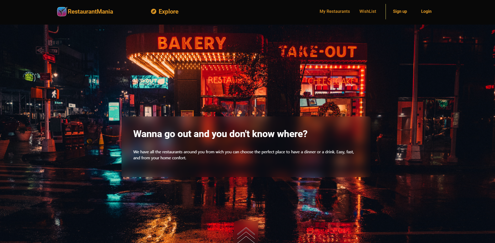
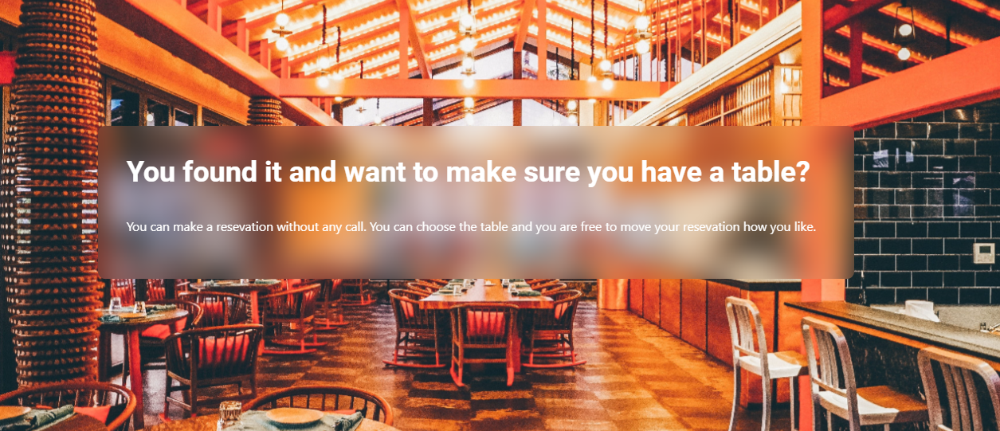
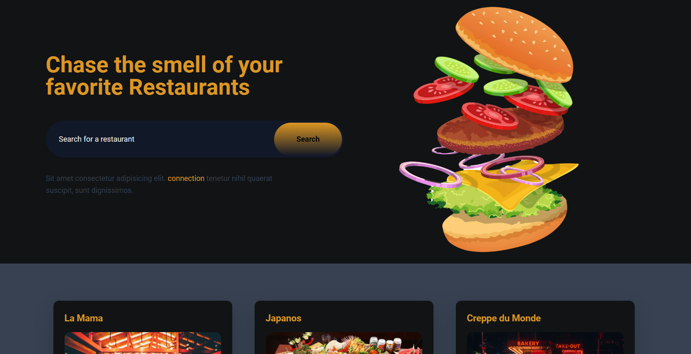
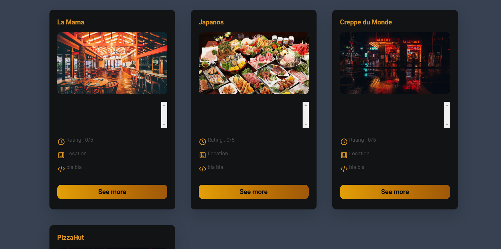
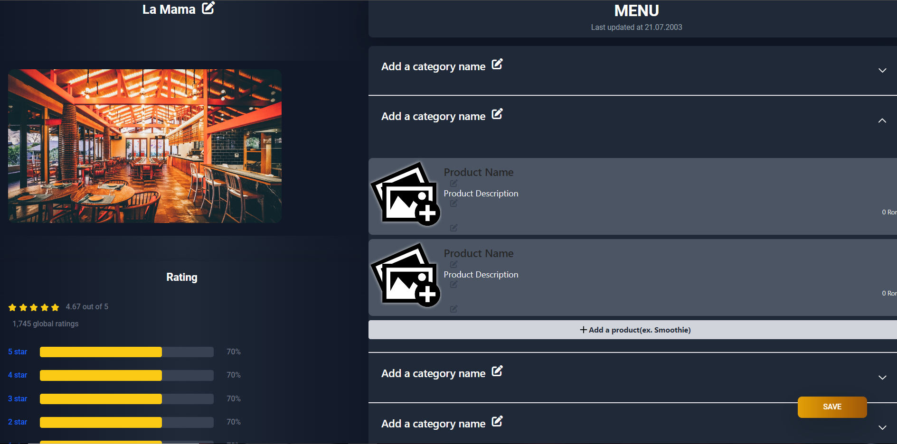

# RestaurantMania

## Project Description

The purpose of this application is to help users easily and quickly find their desired restaurants. It provides a comprehensive list of restaurants with detailed information, including location, operating hours, menus, prices, product images, and ratings. Users can also publish their own restaurants and easily update their content.

### Technologies used:

- Spring
- Supabase
- Amazon Web Services (AWS)
- React
- Bootstrap
- Tailwind
- CSS

We used Spring to accelerate Java application development, creating the necessary APIs for our frontend and establishing repositories for our database. Supabase, a remote database similar to PostgreSQL, is accessible for all project developers. AWS, a cloud computing platform from Amazon, facilitated storing and accessing restaurant and product images. React, a popular web application library, was chosen for its effectiveness in creating interactive and dynamic UI components. We utilized Bootstrap and Tailwind for impressive and responsive styling, along with custom CSS.

### Challenges

- As first-time users of Spring, creating CRUD operations and establishing database relations presented a minor challenge.
- While attempting to use Supabase's Storage service, we found limited documentation and an unfinished library, leading us to use AWS storage instead.

### Future Plans

- The app is currently a demo; our next step is implementing payment functionality for users registering a restaurant.
- We plan to add the option for users to reserve a table.
  
- Additionally, we want the app to prioritize displaying restaurants around the user based on their location.

## Setup

### Backend Setup:

1. **Prerequisites:**
   - Ensure you have the latest LTS (Long Term Support) version of Java Development Kit (JDK) installed on your system.
   - If needed, reload Maven dependencies by right-clicking the `pom.xml` file and selecting "Maven -> Reload Project."

2. **Run the Server:**
   - Start the backend server by running the `RestaurantManiaApplication` class.
   - The server should now be up and running.

### Frontend Setup:

1. **Prerequisites:**
   - Make sure Node.js is installed and properly configured on your system.

2. **Install Dependencies:**
   - Navigate to the `Frontend` directory in your terminal.
   - Run the following command to install the necessary dependencies:
     ```
     npm install
     ```
     (Alternatively, you can use `pnpm install`.)

3. **Run the Frontend:**
   - Once the dependencies are installed, run the following command to start the frontend:
     ```
     npm run dev
     ```
   - Click on the link provided in the terminal to open the page and experience RestaurantMania!

### How to use 

Pressing on Explore button you can access the page where all the Restaurants are listed.



Here you can search for a restaurant or navigate through all the listed restaurants


Pressing "See more" of any restaurant will send the user to page where all the details are listed (we don't have moking data for menu yet)
